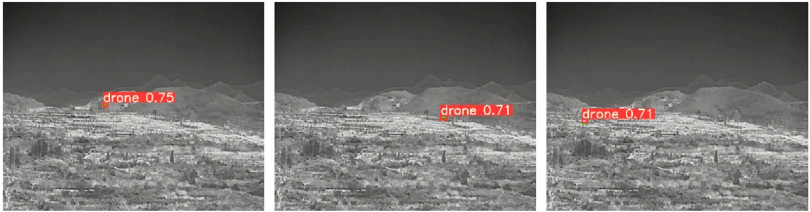
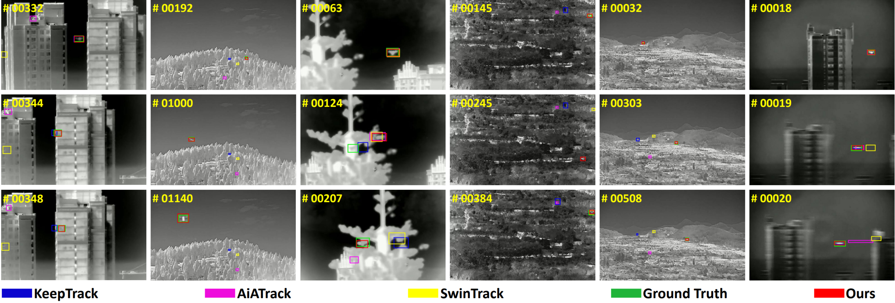
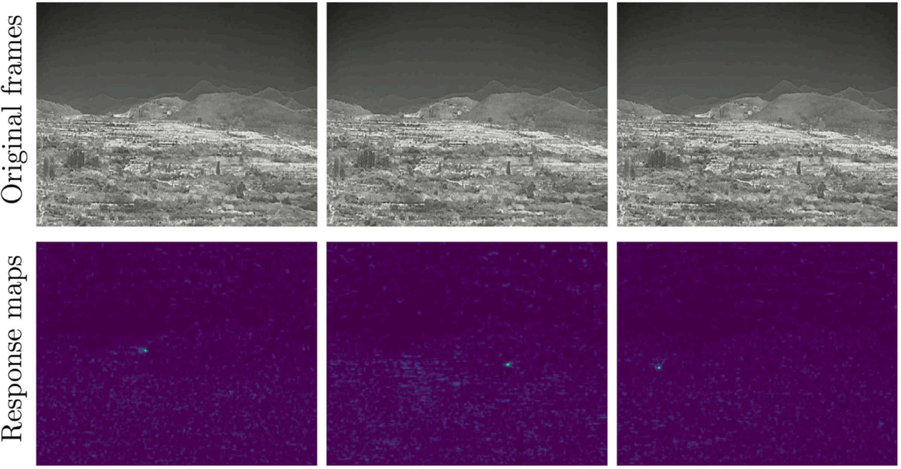
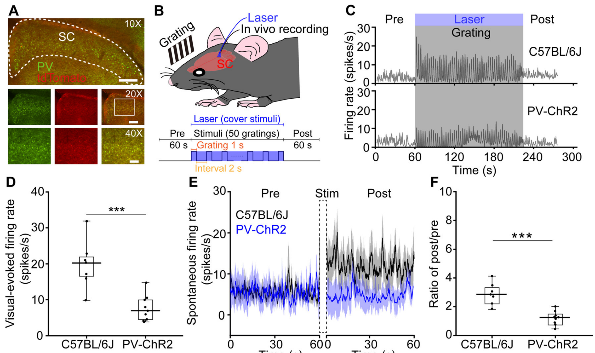

Please find the full publication list through the [Google Scholar profile](https://scholar.google.com/citations?user=YOtXJvQAAAAJ&hl=zh-CN). The publications mainly address vision problemes of:
* **Tiny video-object detection (TVOD)**

  
* **Visual object tracking (VOT)**

* **Bio-vision modelling**

* **Retina/V1 neuroscience**

* ...

Should you have any questions about the papers, please feel free to contact me.
